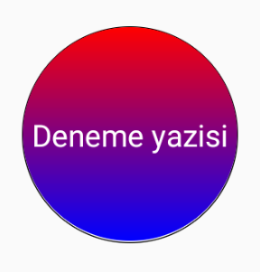

# react-native-circle-view

Circle wrapper for your content.

Props -> radius, content, style, modify_style, if_gradient

radius: 
radius of circle area, set default to 50

content -> you should send what you want to have in circle view

you can use a function to return just a text or a view containing many other things.

renderV() {
    return <'Text>Deneme yazisi</Text'>;
  }

content={this.renderV()}

style:
if you dont want to use default styles.circle in code use this.

modify_style:
if you just want to change something in default styles.circle or add something you can use this prop and you will keep default style's features same or modify the part you redeclare in modify_style.

if_gradient: 
if you want gradient colors in background you should use this prop. default is if_gradient = [false, ['#fff', '#ddd'], 'vertical'], if you want gradient background boolean must be true, if you use any other variable it will assume its false. second thing is colors, you have to use more than 1 color since it is a gradient background, third one is direction of gradient, options are vertical and horizontal as string, if you use any other variable its going to assume its vertical, for horizontal using 'horizontal' is a must

and because this is a circle view height, borderRadius, width props depend on radius so you cant redeclare this props in style or modify_style. radius is enough to change them.
